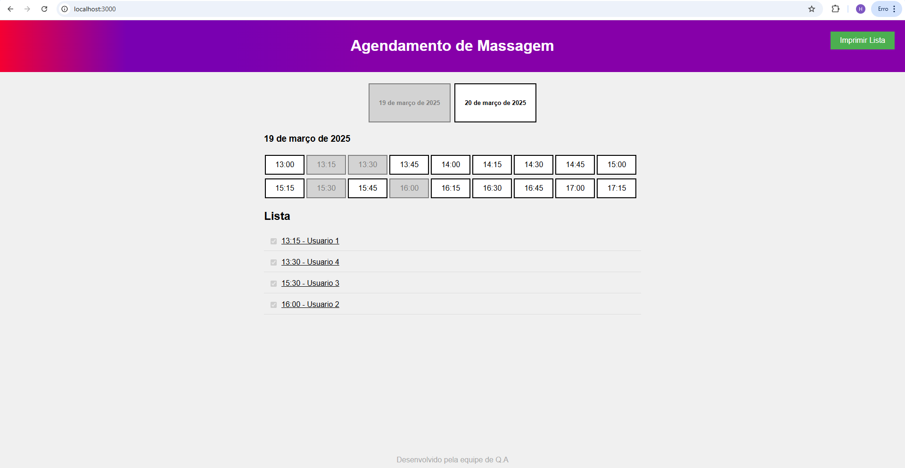

# 🧖‍♂️ `Massage Appointment`

Um sistema simples de agendamento de massagem onde os usuários podem escolher o horário desejado e informar o nome. O nome será adicionado à lista de agendamentos.

🚀 Tecnologias Utilizadas

🖥️ HTML → Estrutura do sistema

🎨 CSS → Estilização da interface

⚡ JavaScript → Funcionalidade e manipulação de dados

📸 Demonstração

Nota: Certifique-se de adicionar a imagem massage_appointment_demo.png à pasta assets/ no seu repositório para que ela seja exibida corretamente.

📌 Funcionalidades

✔️ Escolha do horário desejado✔️ Inserção do nome para agendamento✔️ Apresentação da lista de agendamentos em tempo real✔️ Interface amigável e intuitiva

🛠️ Como Executar o Projeto

Clone este repositório:

git clone https://github.com/seu-usuario/MassageAppointment.git

Acesse a pasta do projeto:

cd MassageAppointment

Execute o servidor com o seguinte comando:

node serve.js

Acesse o sistema no navegador.

🎨 Estilização

O projeto conta com um design leve e moderno, garantindo uma experiência agradável para os usuários.

📂 Estrutura do Projeto

📁 MassageAppointment/  
│   └── 📂 public  
│       └── 📂 assets # Pasta para imagens e mídias  
│           └── 🖼️ massage_appointment_demo.png  # Imagem de demonstração  
│       └── 📂 gui  
│           └── 📂 themes  
│               └── 📂 icon  
│                   └── ⭐ favicon.icon  # Ícones para a aba do navegador              
├────── 📄 index.html      # Estrutura da página  
├────── ⚙️ script.js       # Lógica de funcionamento  
├────── 🎨 style.css       # Estilos do projeto  
├── ⚙️ .env            # Variáveis de ambiente    
├── 📜 README.md       # Documentação  
├── 🖥️ serve.js        # Servidor  

🚀 Melhorias Futuras

🔹 Validação de horários duplicados🔹 Integração com banco de dados para armazenamento persistente