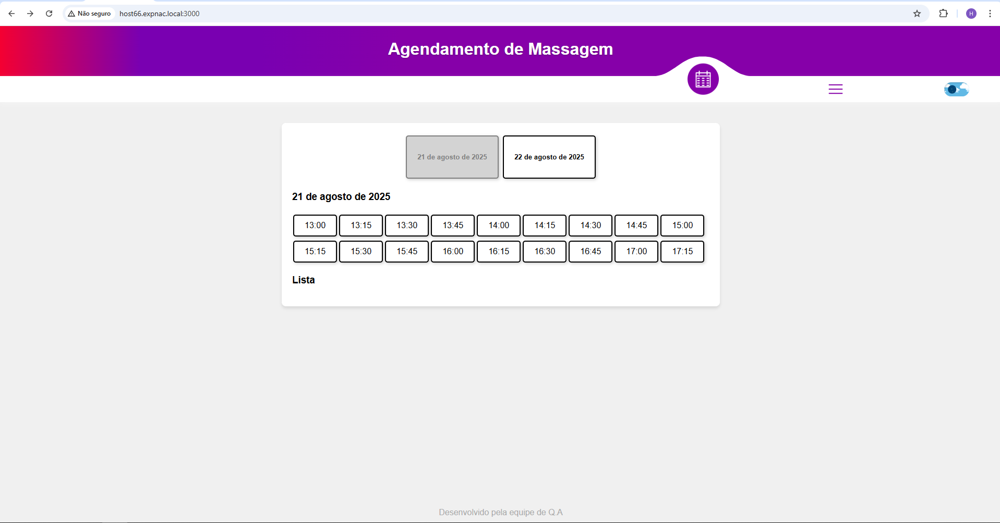

# 🧖‍♂️ Massage Appointment

**Antes**  

**Depois**  

Um sistema simples de agendamento de massagem onde os usuários podem escolher o horário desejado e informar o nome. O nome será adicionado à lista de agendamentos.

🚀 Tecnologias Utilizadas

🖥️ HTML → Estrutura do sistema

🎨 CSS → Estilização da interface

⚡ JavaScript → Funcionalidade e manipulação de dados

📸 Demonstração

## 📌 Funcionalidades

✔️ Escolha do horário desejado
✔️ Inserção do nome para agendamento
✔️ Apresentação da lista de agendamentos em tempo real
✔️ Modal de Senha para Limpar a lista de agendamentos com comando oculto
✔️ Interface amigável e intuitiva
✔️ Alternância entre modo claro e escuro (Dark Mode) para melhor experiência visual
✔️ Histórico de agendamentos por pessoa, permitindo consulta de registros anteriores
✔️ Impressão rápida da lista de agendamentos diretamente pelo sistema
✔️ Atualização automática (auto refresh) dos horários disponíveis sem recarregar a página
✔️ Notificação visual para novos agendamentos em tempo real
✔️ Design responsivo, garantindo usabilidade em dispositivos móveis, tablets e desktops
✔️ Possibilidade de cancelar ou editar um agendamento já existente
✔️ Filtros e buscas para localizar agendamentos específicos de forma rápida
✔️ Estrutura modular com carregamento dinâmico de páginas sem perder o estado do sistema
✔️ Proteção extra com modal de senha para ações administrativas
✔️ Verificação de agentamento já existente impedindo duplicidade.
✔️ Percistencia dos dados com json.

## 🛠️ Como Executar o Projeto

Clone este repositório:

git clone https://github.com/seu-usuario/MassageAppointment.git

Acesse a pasta do projeto:

cd MassageAppointment

Execute o servidor com o seguinte comando:

node serve.js

Acesse o sistema no navegador http://localhost:3000

## 🎨 Estilização

O projeto conta com um design leve e moderno, garantindo uma experiência agradável para os usuários.

📂 Estrutura do Projeto

📁 MassageAppointment/  
│   └── 📂 public  
│&nbsp;&nbsp;&nbsp;&nbsp;&nbsp;&nbsp;&nbsp;&nbsp;└── 📂 assets # Pasta para imagens e mídias  
│&nbsp;&nbsp;&nbsp;&nbsp;&nbsp;&nbsp;&nbsp;&nbsp;&nbsp;&nbsp;&nbsp;&nbsp;&nbsp;&nbsp;&nbsp;&nbsp;└── 🖼️ massage_appointment_demo.png  # Imagem de demonstração  
│&nbsp;&nbsp;&nbsp;&nbsp;&nbsp;&nbsp;&nbsp;&nbsp;└── 📂 gui  
│&nbsp;&nbsp;&nbsp;&nbsp;&nbsp;&nbsp;&nbsp;&nbsp;&nbsp;&nbsp;&nbsp;&nbsp;&nbsp;&nbsp;&nbsp;&nbsp;└── 📂 themes  
│&nbsp;&nbsp;&nbsp;&nbsp;&nbsp;&nbsp;&nbsp;&nbsp;&nbsp;&nbsp;&nbsp;&nbsp;&nbsp;&nbsp;&nbsp;&nbsp;&nbsp;&nbsp;&nbsp;&nbsp;&nbsp;&nbsp;&nbsp;&nbsp;└── 📂 icon  
│&nbsp;&nbsp;&nbsp;&nbsp;&nbsp;&nbsp;&nbsp;&nbsp;&nbsp;&nbsp;&nbsp;&nbsp;&nbsp;&nbsp;&nbsp;&nbsp;&nbsp;&nbsp;&nbsp;&nbsp;&nbsp;&nbsp;&nbsp;&nbsp;&nbsp;&nbsp;&nbsp;&nbsp;&nbsp;&nbsp;&nbsp;&nbsp;└── ⭐ favicon.icon  # Ícones para a aba do navegador              
├───── 📄 index.html      # Estrutura da página  
├───── ⚙️ script.js       # Lógica de funcionamento  
├───── 🎨 style.css       # Estilos do projeto  
├── ⚙️ .env            # Variáveis de ambiente    
├── 📜 README.md       # Documentação  
├── 🖥️ serve.js        # Servidor  

## 🚀 Melhorias Futuras

🔹 Integração com banco de dados para armazenamento persistente